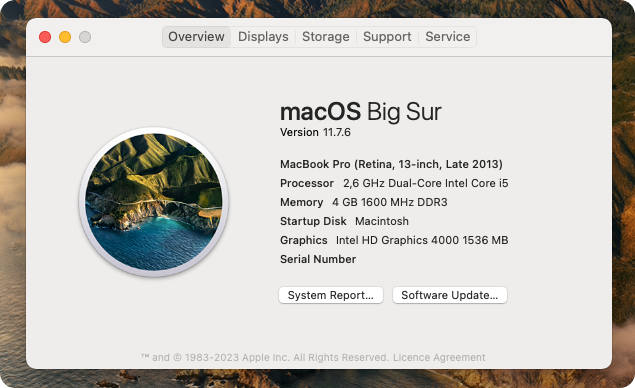

# Dell-Latitude-E6430-Hackintosh
This is my attempt at transforming the Dell Latitude E6430, previously running Windows 7/10 Pro into a hackintosh. This repository allows it to run MacOS Big Sur (v11) using OpenCore.

## Install specifications

| Item     | Version                                                                                     |
|----------|---------------------------------------------------------------------------------------------|
| MacOS    | Big Sur 11.7.6                                                                              |
| OpenCore | 0.9.1-DEBUG                                                                                 |
| BIOS     | [A24](https://www.dell.com/support/home/en-us/drivers/driversdetails?driverid=ng6cn&lwp=rt) |

## Laptop Specifications

| Component Type | Component                |
|----------------|--------------------------|
| CPU            | Intel Core I5-3320M      |
| GPU            | Intel HD Graphics 4000   |
| RAM            | 4GB DDR3 1600Mhz         |
| Storge         | Curcial BX500 240GB 2.5" |
| Panel          | 14.0" HD (1366x768)      |

## Component Support

| Component                | Support                      | Description                                                                                                                                                                                                                                                                  |
|--------------------------|------------------------------|------------------------------------------------------------------------------------------------------------------------------------------------------------------------------------------------------------------------------------------------------------------------------|
| CPU (Power Management)   | Full support                 | Generated SSDT-PM is included.                                                                                                                                                                                                                                               |
| GPU                      | Full support                 | Natively supported. (Last Major OS version to do so.)                                                                                                                                                                                                                        |
| RAM                      | Full support                 | Any RAM should work with this configuration.                                                                                                                                                                                                                                 |
| Storage                  | Full support                 | Any SSD/HDD should work, though having an SSD is highly recommended.                                                                                                                                                                                                         |
| Display Panel            | Full support                 | Fixed screen glitches using framebuffer config. Models with larger screens may need the DeviceProperties edited in the config.plist file, see [Dortania's guide](https://dortania.github.io/OpenCore-Install-Guide/config-laptop.plist/ivy-bridge.html#add-2) for more info. |
| Media Bay w/ DVD-ROM     | Full support                 | MacOS natively supports DVD-ROM drives.                                                                                                                                                                                                                                      |
| Media Bay w/ Battery     | Support unknown / No support | Untested due to missing hardware. I assume it requires a config.plist patch **which is not included**.                                                                                                                                                                       |
| Trackpad                 | Full support                 | Supported with kexts. TIP: Fix dragging in `Accessbility` => `Pointer Control` => `Trackpad Options` => `Enable dragging without drag lock`.                                                                                                                                 |
| Keyboard Backlight       | Full support                 | Supported with kexts.                                                                                                                                                                                                                                                        |
| Audio (IN/OUT/Internal)  | Full support                 | Supported using AppleALC kext.                                                                                                                                                                                                                                               |
| USB 2.0/3.0 Ports        | Full support                 | Fully supported using custom SSDT and kext.                                                                                                                                                                                                                                  |
| eSATA / USB 2.0          | Full support                 | Fun fact: I didn't acutally realize that it can also work as a USB 2.0 slot until a while.                                                                                                                                                                                   |
| Ethernet (RJ45)          | Full support                 | Support using AppleIntelE1000e kext.                                                                                                                                                                                                                                         |
| Phone Modem Line (RJ11)  | Full support                 | Support using AppleIntelE1000e kext.                                                                                                                                                                                                                                         |
| Wifi / Bluetooth         | No support for stock part    | The original part in my model is the Dell DW 1540 which has no support at all in MacOS. Please read the wireless card support section below for more info.                                                                                                                   |
| Separate Bluetooth card  | Support unknown / No support | Untested due to missing hardware. I assume it requires a config.plist patch **which is not included**.                                                                                                                                                                       |
| Web Camera               | Support unknown              | Untested due to component not found on my model.                                                                                                                                                                                                                             |
| Microphone               | Full support                 | Microphones on this model seem to be natively supported by MacOS.                                                                                                                                                                                                            |
| HDMI OUT (Video/Sound)   | Full support                 | Seems like this is natively supported.                                                                                                                                                                                                                                       |
| VGA OUT                  | Support unknown / No support | Untested due to missing hardware. I assume it requires a config.plist patch **which is not included**.                                                                                                                                                                       |
| Dell Docking Connector   | Support unknown / No support | I do not own a dell dock, but I believe the connector bridges the connection using PCIe, so as long as the connectors are mapped it should work.                                                                                                                             |
| SD Card Reader           | Partial support              | MacOS gives the "not readable" error every time a card is plugged in and does not show any signs of data being retained after formatted. Automatic software which partitions it differently may work.                                                                        |
| Battery status           | Full support                 | Fully supported using kexts.                                                                                                                                                                                                                                                 |
| Fn key special functions | Full support                 | Natively supported by MacOS.                                                                                                                                                                                                                                                 |
| Shutdown/Restart/Sleep   | Full support                 | Shutting down, restarting and sleeping is fully supported in the software.                                                                                                                                                                                                   |

### Wireless card support

The original wireless card in my model is the Dell DW 1540. This chipset was never supported in any version and there are no kexts for it available either. Check out [Dortania's Wireless Buyers Guide](https://dortania.github.io/Wireless-Buyers-Guide/) to find one compatible with your system.

#### My personal solution

After consulting with a couple of experienced people about this matter in the [r/hackintosh Paradise Discord](https://discord.gg/u8V7N5C) we came to the conclusion that there is only one chipset which has good native support and is kind of available online in my region (Hungary) for a relatively good price and specs. That is the BCM94360HMB chipset. Cards using this chipset have support for 2.4Ghz & 5Ghz with Bluetooth included. **This chipset also happens to have full support on the Dell Latitude E6430 models.**

> ⚠️ Make sure that the antenna connector sizes match in your laptop!

I ran into that exact issue when ordering my new network card. Fortunately I was aple to tape it down securely enough so that the bigger antenna cables make contact with the smaller antenna ports on the card.

## Security Notes

This OpenCore installation has only been configured with the most basic of security measures. It is up to you wether you want to add more security. You can read the [security part from Dortania's post install guide](https://dortania.github.io/OpenCore-Post-Install/universal/security.html).

### Showing OpenCore GUI (Recovery Mode)

By default there is no password protection for OpenCore's GUI. Which means anyone can access it *if they know the hotkey and when to press it*. You need to hold down the ESC (escape) key from when the Dell logo shows and when it dissapears. You should then be greeted with a menu where you can boot into recovery mode, clear NVRAM or continue booting. 

## Updates

Updates I've made over time can be found here.

*Coming soon!*
